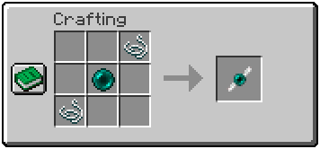
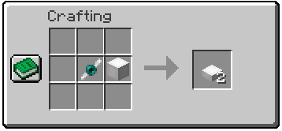
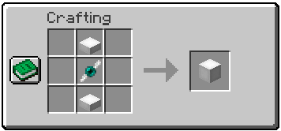

 
   
  
  

  
  
  
  
  

  

Addon independente para o mod **[OpenBlocks Elevator](https://github.com/VsnGamer/ElevatorMod)**, que adiciona variantes em laje dos elevadores, permitindo construções mais compactas e integradas ao cenário.

## 🌟 Funcionalidades & Mecânicas

### 🎨 16 Variações de Cores
*Paridade total com as cores padrão de corantes do Minecraft e compatibilidade com o mod base.*

 

 
 

---

### 🛠️ Receitas de Criação (Crafting)

  
<strong>Ender Spindle</strong> <em>(Ferramenta de Corte)</em>

   
  
  

    
  

  
  > **Detalhes do Item:**
  > - **Durabilidade:** 15 usos antes de quebrar.
  > - **Item Residual:** Permanece na bancada de trabalho ao craftar (*crafting remainder*), perdendo apenas 1 de durabilidade.
  > - **Finalidade:** Utilizado para fatiar 1 bloco de elevador completo em 2 lajes.

 

  
<strong>Elevator Slab</strong> <em>(Fatiando o Elevador)</em>

   
  
  

    
  

  
  > **Instruções:**
  > - Combine **1 Bloco de Elevador** com o **Ender Spindle** na bancada de trabalho para obter **2 Elevator Slabs** da respectiva cor.

 

  
<strong>Elevator Block</strong> <em>(Bloco Completo Base)</em>

   
  
  

    
  

  
  > **Referência:**
  > - Posicione **1 Elevator Slab** acima e **1 Elevator Slab** abaixo com o **Ender Spindle** no centro da bancada de trabalho para fundir as duas metades em **1 Bloco de Elevador Completo**.

---

## 🛠️ Tecnologias e Configuração

---

## 🚀 Como Compilar e Executar

Este projeto é um addon independente e não possui afiliação oficial com o OpenBlocks Elevator. Todos os créditos pelo mod original pertencem a **vsngarcia** e aos seus colaboradores.
